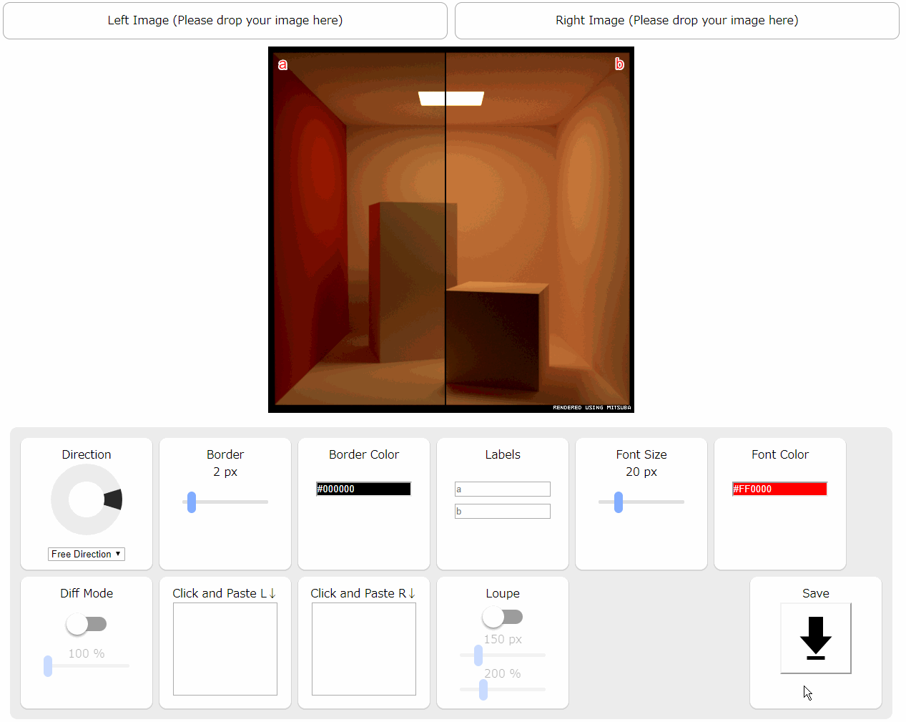
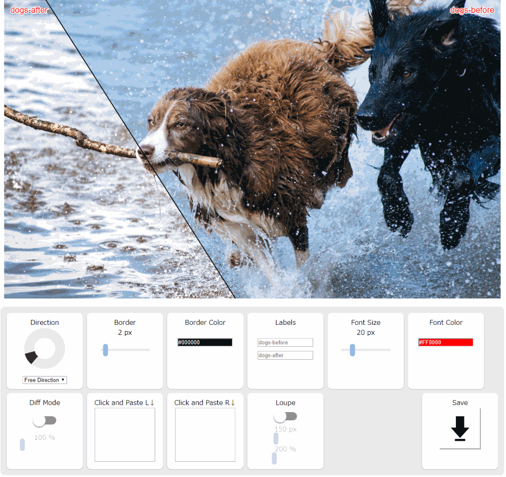

## Simple Image Compare Tool
Pages
http://Ushio.github.io/SimpleImageCompareTool3

## dependencies 
https://jquery.com/

https://github.com/eligrey/FileSaver.js/

https://github.com/patriciogonzalezvivo/glslCanvas

http://huebee.buzz/

https://github.com/aterrien/jQuery-Knob

https://github.com/layerssss/paste.js

## How to use
### Basic Usage

### Diff Mode

### Loupe Mode

## TODO
- 4 images
