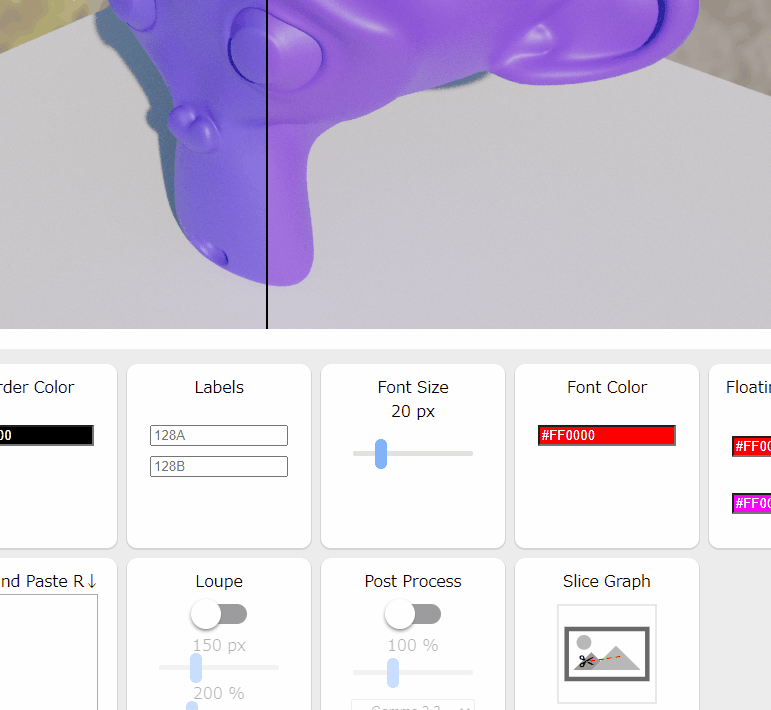
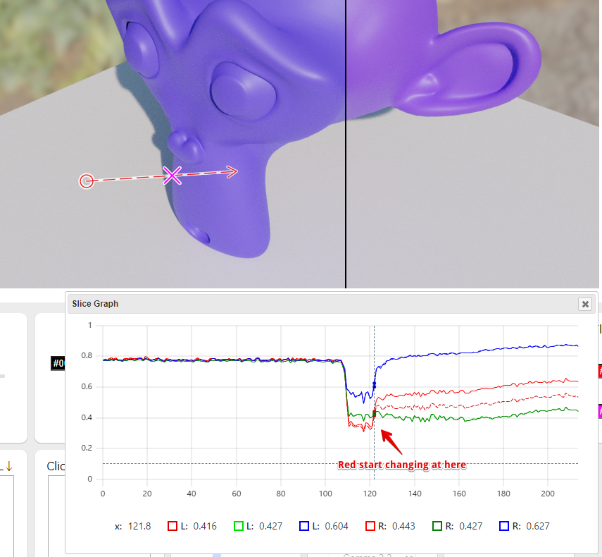

## Simple Image Compare Tool
Pages
http://Ushio.github.io/SimpleImageCompareTool3

## features 
- Handy image comparation
- Flexible wipe direction
- Auto Text label layout
- Diff mode
- Loupe mode
- Simple Post Processing (Scale, Gamma)
- OpenExr Support
- Slice Graph. Inspired by [Steve Wright, "Digital Compositing for Film and Video"](https://www.amazon.co.jp/Digital-Compositing-Film-Video-Production-ebook/dp/B088NMQHT9/ref=tmm_kin_swatch_0?_encoding=UTF8&qid=&sr=)
- (Experimential) Detecting Bias in Monte Carlo Renderers using Welch’s t-test ( http://jcgt.org/published/0009/02/01/ )

## dependencies 
https://jquery.com/

https://github.com/eligrey/FileSaver.js/

https://github.com/patriciogonzalezvivo/glslCanvas

http://huebee.buzz/

https://github.com/aterrien/jQuery-Knob

https://github.com/layerssss/paste.js

https://github.com/disneyresearch/openexr-wrap-em

https://github.com/leeoniya/uPlot

## How to use
### Basic Usage

### Diff Mode

### Loupe Mode

### Slice Graph

## TODO
- 4 images
